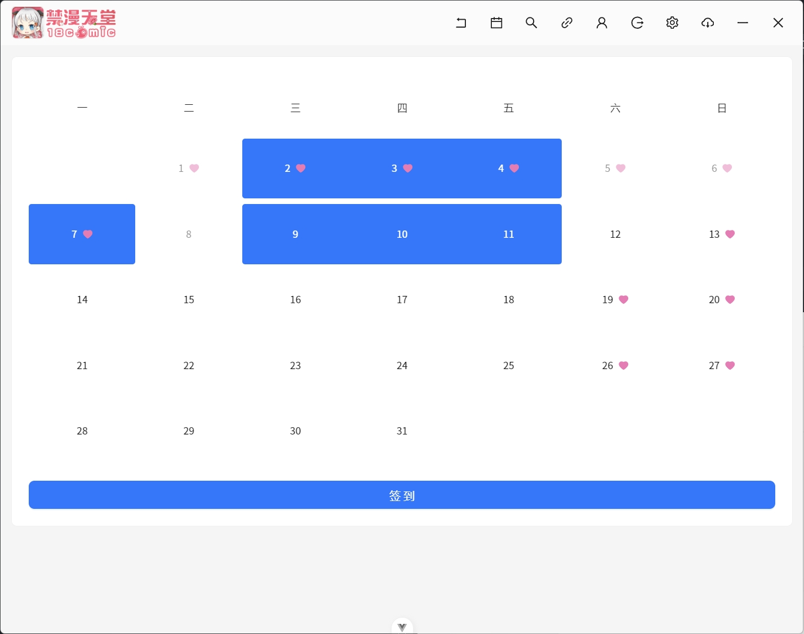

# jm-desktop

这是一个禁漫的第三方客户端，基于 electron + vue 构建。

## NSFW 警告⚠

请勿在公共场合使用本软件。

## 功能

- [x] 登录
- [x] 搜索
- [x] 阅读
- [x] 收藏
- [x] 简易用户信息
- [x] 阅读历史
- [x] 漫画详情
- [x] 历史评论
- [x] 漫画评论
- [x] 发表评论
- [x] 相关漫画
- [x] 首页推荐
- [x] 漫画下载（JCoin 付费本目前不支持）
- [x] 目录阅读

## 截图

## 声明

本软件仅用于教育、学习和研究目的，旨在帮助开发者和用户理解应用程序的工作原理。作者与原始应用程序的开发者、公司或组织无关。所有涉及的代码或技术分析均为个人研究成果，并未用于商业用途或恶意活动。请勿将本软件用于任何违反法律或侵犯原开发者权利的活动。作者不对他人使用本软件产生的任何法律或财务后果承担责任。请在 24 小时内删除本软件。

## 安装包

只提供 win 下的 zip 安装包，解压即用，所有数据只在解压的目录中，整体文件夹可随意拷贝移动（除了下载路径）。

linux 、 mac 用户请使用源码自行构建。