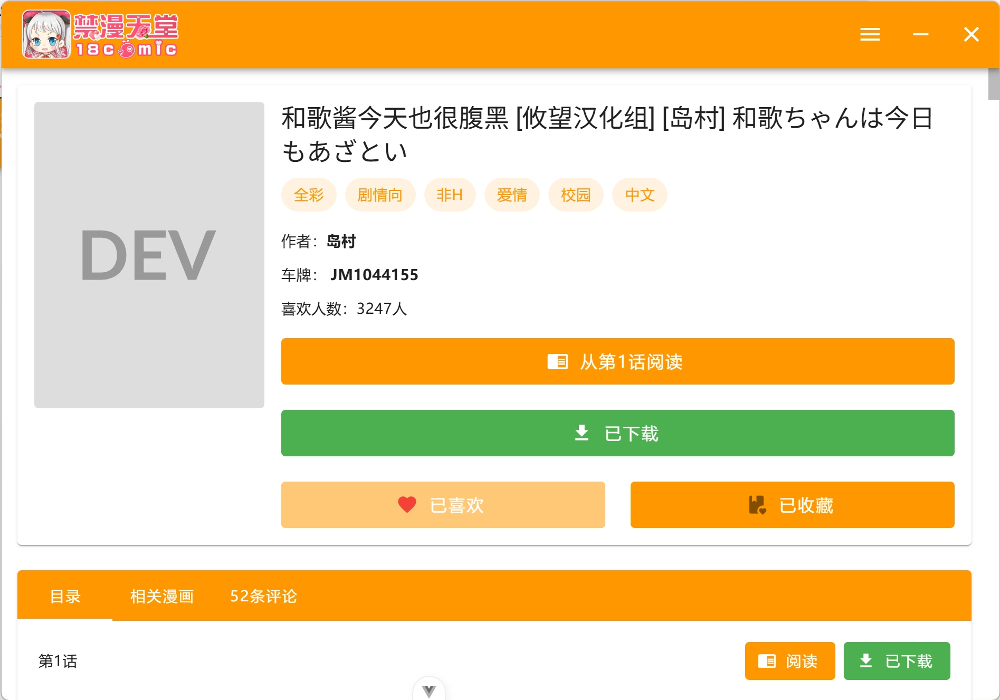
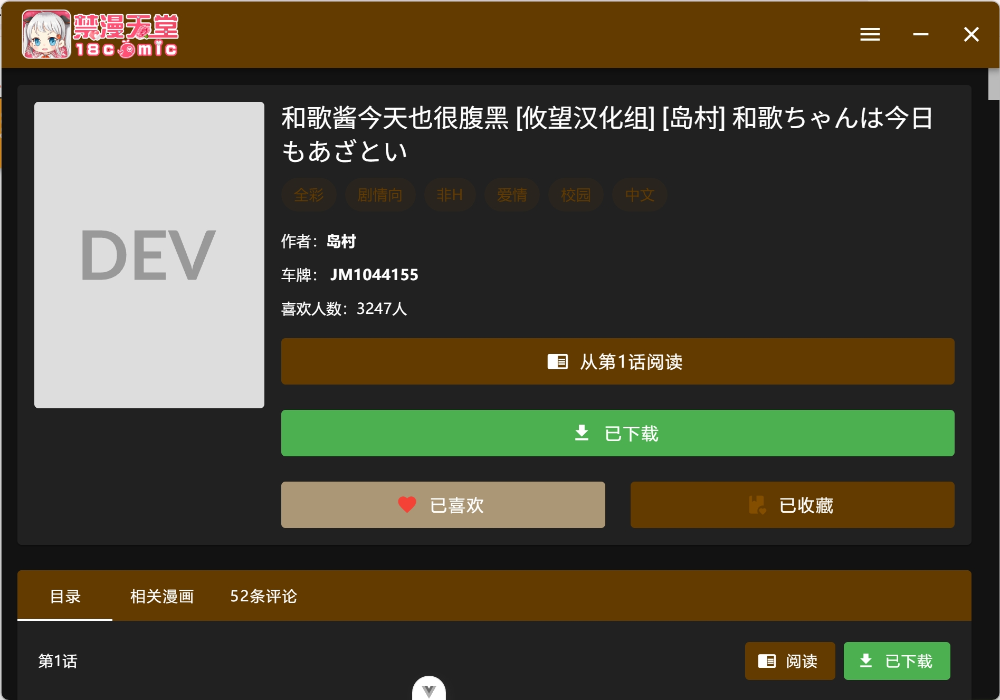
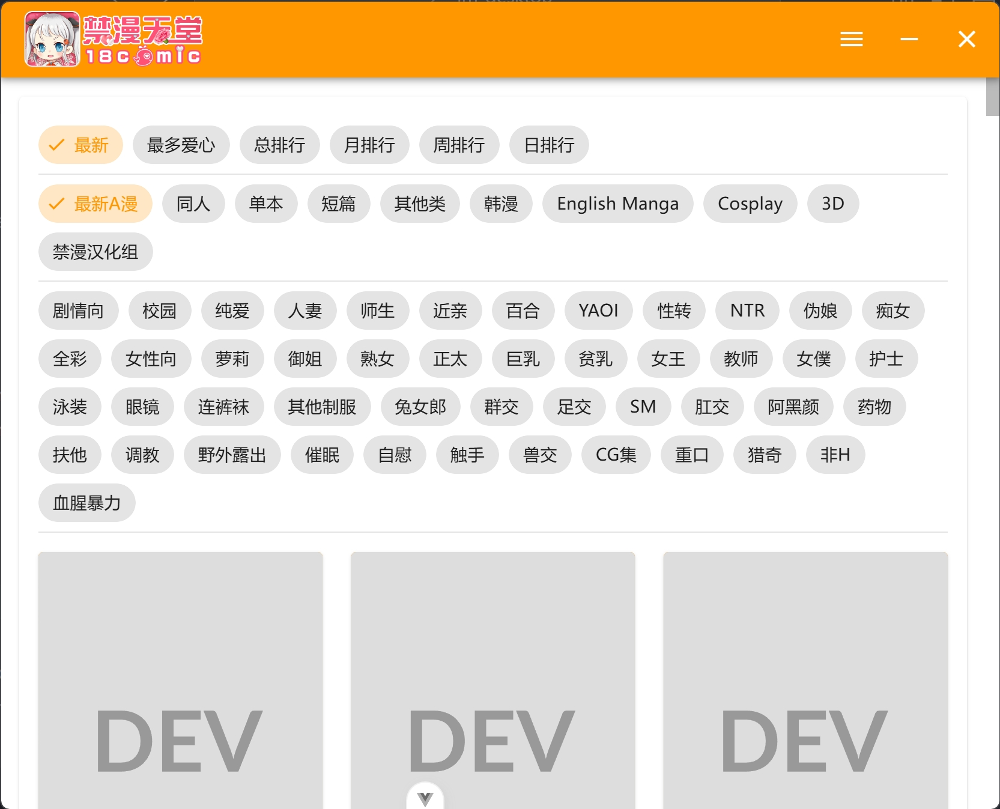
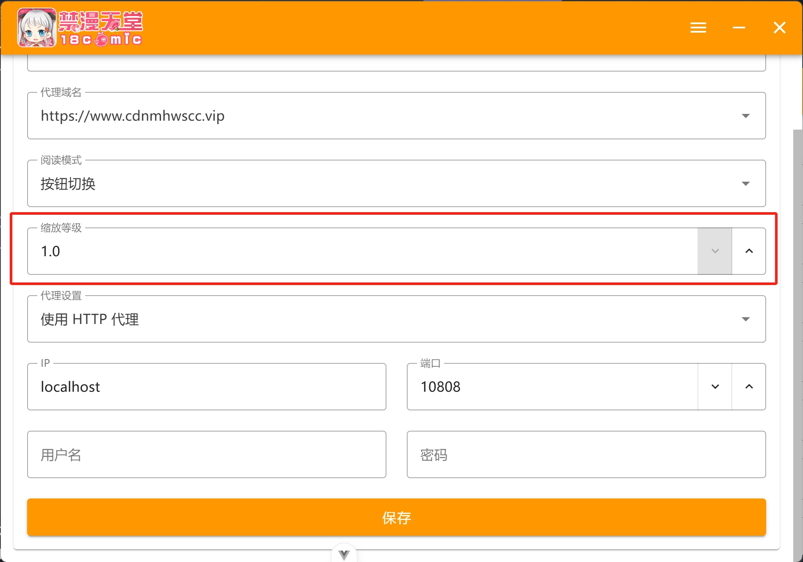

# jm-desktop

这是一个禁漫的第三方客户端，基于 electron + vue 构建。

## NSFW 警告⚠

本软件可能存在裸露、暴力、色情或冒犯等不适宜公众场合的内容，请勿在公共场合使用本软件，避免不必要的纷争。

## 功能

- [x] 登录
- [x] 搜索
- [x] 阅读
- [x] 收藏
- [x] 简易用户信息
- [x] 阅读历史
- [x] 漫画详情
- [x] 历史评论
- [x] 漫画评论
- [x] 发表评论
- [x] 相关漫画
- [x] 首页推荐
- [ ] 漫画下载
- [x] 目录阅读
- [x] 日夜间模式
- [x] 每周必看
- [x] 漫画分类搜索
- [x] 自动登录
- [x] 图片分流

## 截图

由于需要截图原因，部分封面图片已屏蔽。

### 首页

### 个人中心

### 签到

### 详情（日间模式）

### 详情（夜间模式）

### 阅读（翻页模式）

### 阅读（滚动模式）

### 名称搜索

### 分类搜索排序

### 每周必看

## 声明

本软件仅用于教育、学习和研究目的，旨在帮助开发者和用户理解应用程序的工作原理。作者与原始应用程序的开发者、公司或组织无关。所有涉及的代码或技术分析均为个人研究成果，并未用于商业用途或恶意活动。请勿将本软件用于任何违反法律或侵犯原开发者权利的活动。作者不对他人使用本软件产生的任何法律或财务后果承担责任。请在 24 小时内删除本软件。

## 安装包

只提供 win 、 linux 的 x86 绿色包，所有数据（包含下载文件）只在解压的目录中，整体文件夹可随意拷贝移动。mac 用户请使用源码自行构建。

点击[这里](https://github.com/Dedicatus546/jm-desktop/releases)或者右侧的 Release 处下载最新的版本，解压后执行目录内的 jm-desktop 或者 jm-desktop.exe 即可。

相关更新请查看项目的 CHANGELOG 文件。

## 相关帖子

- [https://prohibitorum.top/202da2aab6d1](https://prohibitorum.top/202da2aab6d1)
- [https://prohibitorum.top/d5936495bfca](https://prohibitorum.top/d5936495bfca)

## 问题

### 读取网址设置失败

请在设置中启用代理，这里填写的为默认的 V2rayN 的代理地址，如下图所示

并将 api 添加到你的代理规则中，V2rayN 默认的 v3 路由规则已可以代理该域名，手动添加如下图

### 高分辨率下字体过小

windows 百分百缩放设置下，请在设置中更改缩放等级，建议 2k 屏幕设置为 1.4 ， 4k 屏幕为 1.8 ，如下图

### 漫画跳转不正确

很大概率是接口过期了，请提 issue ，或者可以通过以下方式自己更新。

首先确保你已知道最新的 api 接口，这里推荐使用 MuMu 模拟器 + reqable 抓包，需要开启模拟器的 Root 权限以及存储读写，Reqable 需要放置生成的证书到指定位置，启动抓包后只需在 reqable 中搜索 /setting 路径，即可确定 api 。

接着打开程序根目录的 /data/config.json 文件，在 apiUrl 处填上你抓包的接口，在 apiUrlList 处填入新的接口，如下：

完成之后启动软件即可，注意以上操作请不要在软件打开的情况下操作，软件运行过程中会在必要的时候对该文件覆写，可能导致你的修改失效。

---

如果你喜欢该软件，动动小手点个 star 就是对我最大的鼓励和帮助🙇‍！